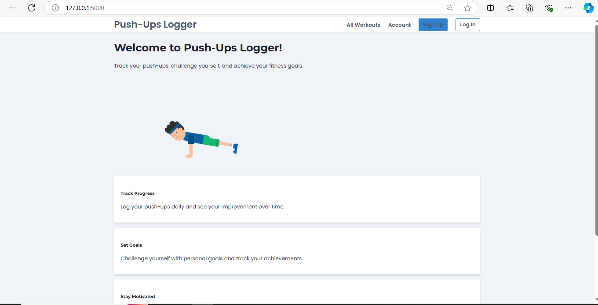
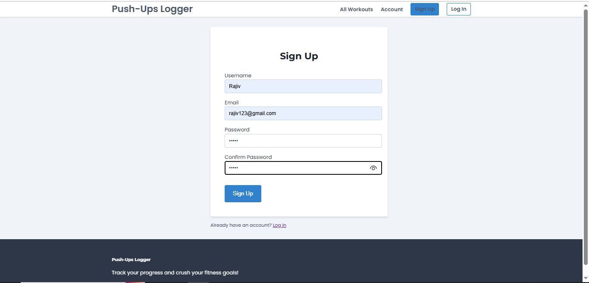
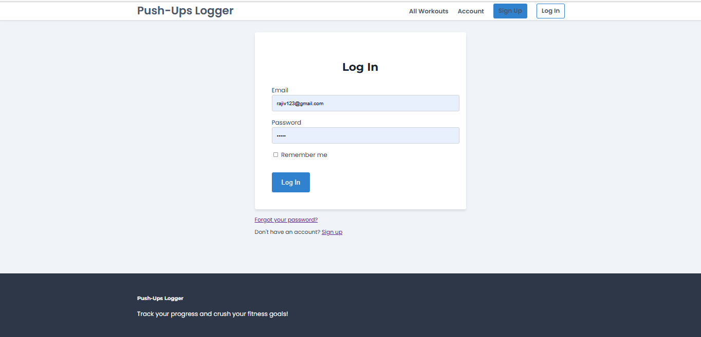
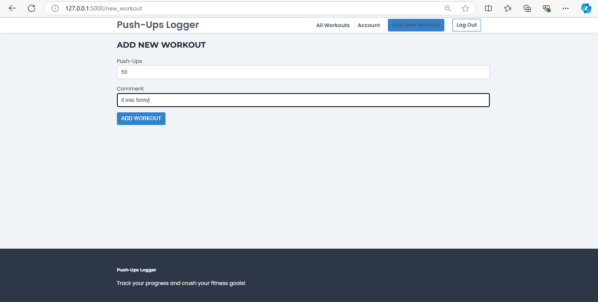
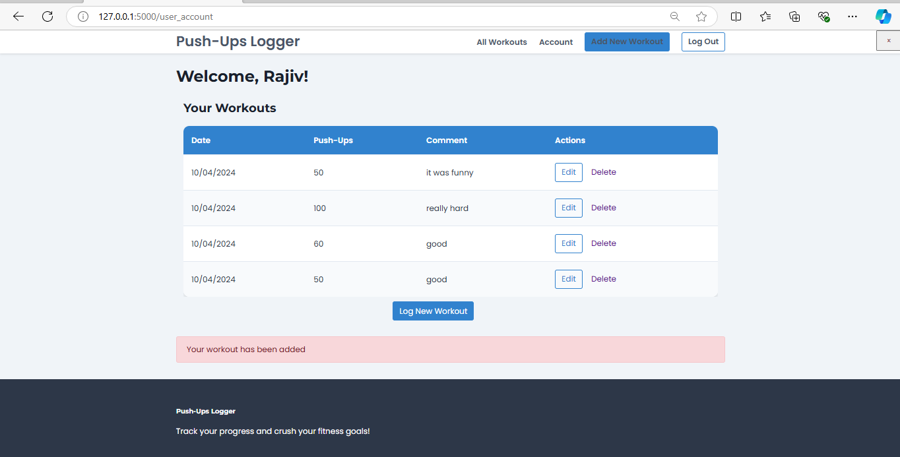

# Push-Ups Logger

Push-Ups Logger is a web application built with Flask that allows users to track their push-up workouts and monitor their progress over time. This application is perfect for fitness enthusiasts who want to improve their push-up performance and stay motivated.







## Features

- User authentication (signup, login, logout)
- Password reset functionality
- Create, read, update, and delete push-up workout entries
- View workout history
- Responsive design for mobile and desktop use

## Technologies Used

- Python 3.x
- Flask
- SQLAlchemy
- Flask-Login
- HTML/CSS
- SQLite (for development)

## Installation

1. Clone the repository:
   ```
   git clone https://github.com/charans2702/push-ups-logger.git
   cd push-ups-logger
   ```

2. Create a virtual environment and activate it:
   ```
   python -m venv venv
   source venv/bin/activate  # On Windows, use `venv\Scripts\activate`
   ```

3. Install the required packages:
   ```
   pip install -r requirements.txt
   ```

4. Set up the environment variables:
   Create a `.env` file in the root directory and add the following:
   ```
   FLASK_APP=app.py
   FLASK_ENV=development
   SECRET_KEY=your_secret_key_here
   ```

5. Initialize the database:
   ```
   flask db init
   flask db migrate
   flask db upgrade
   ```

## Running the Application

To run the application locally:

```
flask run
```

The application will be available at `http://localhost:5000`.

## Project Structure

- `instance/`:databases
  - `user.db`
- `static/`: Static files (CSS,images)
- `templates/`: HTML templates for the application
  - `base.html`: Base template with common structure
  - `index.html`: Home page
  - `login.html`: Login page
  - `signup.html`: Signup page
  - `profile.html`: User profile page
  - `create_workout.html`: Form to add new workout
  - `user_account.html`: Page to display user's workouts
  - `update_workout.html`: Form to update existing workout
- `app.py`: Main application file containing routes and database models
- `requirements.txt`:Contains all the required Libraries.


## Contributing

Contributions are welcome! Please feel free to submit a Pull Request.

## License

This project is open source and available under the [MIT License](LICENSE).
